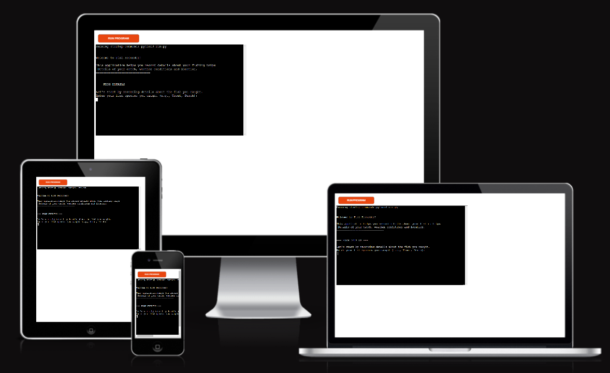
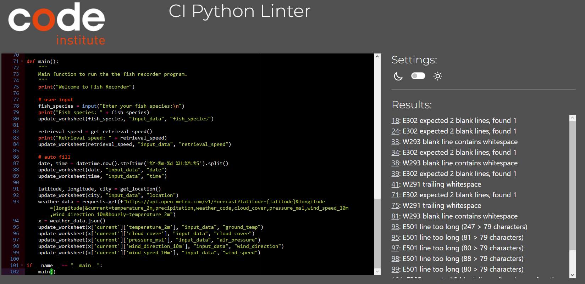
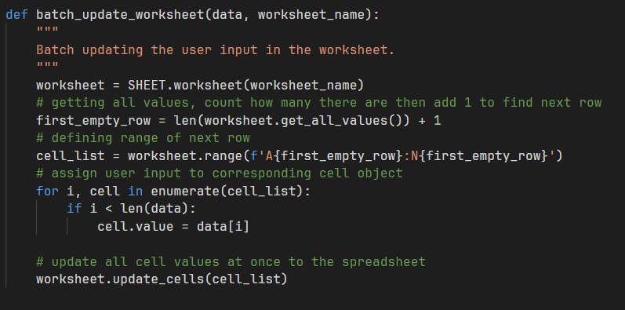

# Fish Recorder

[Visit website here](https://fish-recorder-6d6994a06f94.herokuapp.com)

[Link to Google Sheets](https://docs.google.com/spreadsheets/d/1m_ye5kXZaw83oSMR0_k9Mbdj-be4N12jbOe3ayYSm-k/edit#gid=0)

Fish Recorder is an interactive Python application designed for sport fishing/hobbyists to record and track details of their fishing trips. This tool helps capture information such as fish species, size, water clarity, lure details and automatically fetches the users location and current weather data. This website was made for educational purposes only.

### Target Audience

The Fish Recorder application is designed with a specific user group in mind, all inclusive of individuals who are passionate about fishing and have an interest of recording and analysing their fishing experiences. Target group includes:
- Recreational anglers, who enjoy fishing as a leasure activity and want to keep a log of their catches.
- Sport fisherman, competitive anglers who requires detailed records of their fishing to find patterns in order to improve their fishing strategies and success.
- Fishing guides, who maintain detailed records of various fishing trips for reference and teaching purposes.
- Researchers, who study marine environments that can use the data for research on fish behaviour for example.

### Application Logic Flow

The Fish Recorder application follows a intuitive and straightforward flow of logic to ensure ease of use for any angler. Below is an outline involving some key steps used in the application's proccess:

1. Start-Up and Welcome
    - When launched, users are greeted with a welcome message and some brief instructions.
    
    

2. Fish Details Input
    - The user enters details about the fish they caught, includes species and size.

    

3. Environmental Contitions Input
    - The application prompts the user for information about water clarity and lure retrieval speed.

    

4. Lure Detail Input
    - The user selects lure type from predefined list and input the colour or colours of the lure.

    

5. Automated Data Collection
    - The application fetches the user's location and weather data automatically.

    

6. Data Compilation
    - All the user-provided and fetched data is gathered and compiled into a structured format for recording.
7. Google Sheets Update
    - The compiled data is sent to a Google Sheet, updating the next available row.
8. Completion Confiramtion
    - The user receives confirmation that their data has been recorded successfully.

    

9. Conclusion or Continuation
    - The user can choose to end the session or start a new entry.

## Features

The Fish Recorder application offers a comprehensive suite of features designed to help sport fisherman record and analyze their fishing trips in detail. Following is an overview of it's capabilities:

- Automated Location and Weather Data Retrieval
    - Automatically fetches the user's current geographical location with use of their IP address.
    - Gathers realtime weather data for the user's location, including temperature, cloud cover, air preassure, wind speed and wind direction through an API.

- Interactive user input
    - Prompts user's to specific details of their catch such as species, size, and lure charateristics.
    - Validates user input to ensure accurate and consistent data entry.

- Google Sheets Integration
    - Interacts seemlessly with Google Sheets for efficient data storage and management.
    - Batch updates the worksheet with all recorded data to ensure organized records

- Error handling
    - Implemented error handling for location and weather data retrieval to ensure functionality even if external APIs would fail.

## Technologies Used

The following technologies has been used to make this website work:

- [Python](https://developer.mozilla.org/en-US/docs/Glossary/Python)
    - Core programming language used for developing this application.
- [gspread](https://docs.gspread.org/en/latest/)
    - Is a python library, used for interacting with Google Sheets. Makes the process of "reading from and writing to" simpler.
- [requests](https://docs.python-requests.org/en/latest/index.html)
    - Is a HTTP python library, used for making API calls and fetching location and weather data. 
- [Google Sheets API](https://developers.google.com/sheets/api/guides/concepts)
    - Used for integrating the application with Google Sheets to store the generated data.
- [IP Geolocation API](https://ipgeolocation.io)
    - Used to automatically determine the user's geographical location based on their IP address.
- [Open-Meteo API](https://open-meteo.com/en/docs)
    - Used to fetch real-time weather data, providing the environmental contitions for the aplication.
- [Heroku](dashboard.heroku.com/)
    - Is a cloud platform that enables deployment and hosing of applications. Used to deploy the CLI (Command Line Interface) version of Fish Recorder.
- [GitHub](https://github.com/)
    - Used for storing pushed code.
- [Git](https://git-scm.com/)
    - Used to track changes in the code through  terminal commits and pushing from VS Code to GitHub. 
- [Visual Studio Code](https://code.visualstudio.com)
    - Used as a code editor.
- [Code Spell Checker](https://marketplace.visualstudio.com/items?itemName=streetsidesoftware.code-spell-checker)
    - Extension software used to fix spelling errors across the project.
- [Am I Responsive](http://ami.responsivedesign.is/)
    - Used to make responsive image for README.md file.
- [PEP8 linter](https://pep8ci.herokuapp.com/#)
    - Used to validate python code and check for errors.
- 

## Testing

Throughout the development of the Fish Recorder application, continuos testing was implemented to ensure a high level of quality and reliability. The testing focused on several key areas to deliver good performance and a userfriendly experience.

Testing Approach

- Continuos Testing Throughout Development
    - Testing functions and code interactions in increments to allow for catching problems or misstakes early and allowing to pinpoint eventual errors.
- Code Quality with PEP8 Linter
    - Tested the quality of the code several times through the development using a PEP8 linter. This tool helped catching indentation errors mostly and making sure the code was up to par.
    
    

    - Also helped catching errors in the code with error specification when code was left bare.

    

- Optimizing Google Sheets Interaction
    - Recognizing further into the development that the updating of the Google Sheets was suboptimal and making the application slow. This was solved by using batch processing the data to the Google Sheets rather then calling one by one. This resulted in a much better and more userfriendly application.
    
    

- Error Handling and Input Validation
    - During development various input scenarios was being tested to insure error handling was on point  and the code would not break. As usual there is always room for improvement.
- Real-World Scenario Testing
    - Simulating real user interactions was a key part of the testing process. By trying different input combinations to get a better grasp on how the application in diffrent user situations.

## Known bugs and fixes

- Solved bugs
    - There was a bug with fetching the weather data through the API at one point during the testing. But after making sure there was no issues it's was probably an external error that was temoprary. There is error handling in place for malfunction on external API services after testing to make sure data is entered as "null" in case external errors occur to keep the structure of the data intact.
    - Had an error when validating the code where the lines were too long. Managed to edit them down so that the code is now valid and working as intended.
    

## Deployment

This project was deployed using Heroku as a deployment platform.

Steps for deployment:

1. Fork or clone this repository
2. Create a new Heroku app
3. Name your App and choose region then click "create app"
4. Go to settings then config vars, for the key enter CREDS and for the value copy and paste your entire creds.json file. If your project does not have a credentials file then skip this part.
5. Add buildpacks, select Python then save changes. Add another buildpack, nodejs and save changes again.
6. Go to the Deploy tab, select GitHub and confirm by clicking Connect to GitHub.
7. Search for your repository name, when you have found it press connect to link your Heroku app to your repository.
8. Your can choose automatic deployment that rebuilds the app everytime you push new code to your repository, or manually deploy wich ever you prefer.
9. After it has finished building your project click view to see your project.

*Forking the GitHub Repository*

If you want to make any changes to your project without affecting it you can make a copy by "forking" this ensures that your original repository remains unchanged.

1. Find the repository on Github
2. In the top right corner you can click on the Fork button
3. The repository has now been "Forked" and you now have a copy that you could work on

*Cloning the Github Repository*

Cloning your repository allows you to download a local version of the repository to work on, very useful to backup your work.

1. Navigate to the repository
2. Press the "Code" button
3. Select the "Local" tab in the dropdown menu
4. Copy the HTTPS link provided
5. Type "git clone" and paste your link
6. Press enter and you will now have a local clone of your repository

## Credits
 
 Websites used during the project copied code is mentioned as comments in the code:

 - [Weather API call](https://open-meteo.com/en/docs#current=temperature_2m,precipitation,weather_code,cloud_cover,pressure_msl,wind_speed_10m,wind_direction_10m)
 - [date,time](https://stackoverflow.com/questions/415511/how-do-i-get-the-current-time)
 - [Error handling](https://stackoverflow.com/questions/6817640/catch-any-error-in-python)
 - [gspread](https://docs.gspread.org/en/latest/user-guide.html#updating-cells)
 - [realpython](https://realpython.com/python-requests/)
 - [stackoverflow](https://stackoverflow.com/questions/43333625/find-computer-geographic-location-python)
 - [ip-api](https://ip-api.com/docs)
 - [google devs](https://developers.google.com/sheets/api/guides/batchupdate)
 - [realpython](https://realpython.com/python-main-function/)

## Acknowledgements

I want to thank my mentor Harry Dhillon for giving support through the project and my girlfriend Sabrina Fonseca Pereira for her support and feedback.

 